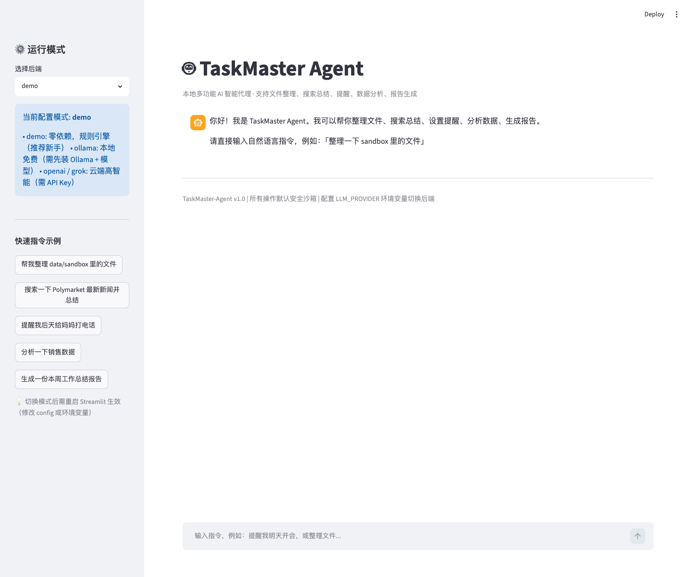

# 🤖 TaskMaster-Agent

> **真正能用的本地多功能 AI 智能代理**  
> 编程小白也能拥有的「私人助手」，一句话搞定文件整理、搜索总结、提醒、数据分析、报告生成。

[](https://python.org)
[](https://python.langchain.com/)
[](https://github.com/yeel37/TaskMaster-Agent/actions/workflows/python-tests.yml)
[](LICENSE)

**真实价值**：每天用它处理重复劳动，真正解放双手，同时用高质量提交记录丰富 GitHub，冲击 OpenAI Codex for Open Source！

---

## 🌟 核心能力（全部可立即使用）

| 指令关键词       | 实际功能                     | 示例输入                              |
|------------------|------------------------------|---------------------------------------|
| 整理 / 文件 / 归档 | 安全沙箱文件按类型+日期归档   | "帮我整理 data/sandbox 里的文件"     |
| 搜索 / 总结 / 新闻 | DuckDuckGo 免费搜索 + 摘要   | "搜索 Polymarket 最新动态并总结"     |
| 提醒 / 待办       | 本地持久化提醒列表           | "提醒我后天下午3点开会"              |
| 分析 / 数据 / CSV | 自动分析 data/ 下 CSV        | "分析一下销售数据"                   |
| 报告 / 总结       | 生成带日期的 Markdown 报告   | "生成一份本周任务总结报告"           |

---

## 🚀 10 分钟从零开始（极致详细）

### 1. 安装 Python 3.10+

同 EnergyGuard-AI 文档，不再赘述。

### 2. 克隆 + 进入

```bash
git clone https://github.com/yeel37/TaskMaster-Agent.git
cd TaskMaster-Agent
```

### 3. 虚拟环境（必做）

```bash
python3 -m venv .venv
source .venv/bin/activate   # macOS/Linux
# Windows: .venv\Scripts\Activate.ps1
```

### 4. 安装依赖

```bash
pip install -r requirements.txt -i https://pypi.tuna.tsinghua.edu.cn/simple
```

**注意**：LangChain 生态较大，首次安装可能需要 1-2 分钟，耐心等待。

### 5. 立即运行（Demo 模式，零配置！）

#### 命令行模式（最快验证）

```bash
# 直接用内置规则引擎（无需任何 Key）
python -m taskmaster.cli "整理一下 data/sandbox 里的文件"

python -m taskmaster.cli "提醒我明天给客户回电话"

python -m taskmaster.cli "分析一下销售数据"
```

#### 图形聊天界面（最爽）

```bash
streamlit run app/streamlit_app.py
```

在浏览器里直接聊天，点击左侧示例按钮即可体验全部功能！

## 📸 界面预览

**Web 聊天界面**



---

## 🔧 升级到真正 AI（三种方式）

### 方式一：本地免费（推荐长期使用）

1. 安装 [Ollama](https://ollama.com)
2. 拉取一个好用的中文模型：
   ```bash
   ollama pull qwen2.5:7b
   # 或 llama3.1:8b
   ```
3. 启动 Ollama（默认 11434 端口）
4. 设置环境变量：
   ```bash
   export LLM_PROVIDER=ollama
   export OLLAMA_MODEL=qwen2.5:7b
   ```
5. 重启 Streamlit / CLI 即可使用本地 LLM 驱动的 Agent！

### 方式二：OpenAI（最智能）

```bash
export LLM_PROVIDER=openai
export OPENAI_API_KEY=sk-你的key
```

### 方式三：Grok（xAI，中文优秀 + 便宜）

```bash
export LLM_PROVIDER=grok
export GROK_API_KEY=xai-你的key
```

---

## 📂 项目结构

```
TaskMaster-Agent/
├── README.md
├── requirements.txt
├── data/
│   ├── sandbox/               # 安全文件整理演示区
│   └── sample_sales.csv
├── src/taskmaster/
│   ├── config.py              # 三种模式切换核心
│   ├── agent.py               # 统一 Agent + 5 大工具实现
│   └── cli.py
├── app/
│   └── streamlit_app.py       # 聊天 Web UI
├── tasks/                     # 提醒持久化
├── reports/                   # 生成的报告
└── tests/
```

---

## 🛡️ 安全设计（小白最关心）

- 所有文件操作**默认 dry_run + 沙箱**（data/sandbox），绝不会误删你电脑上的文件
- 即使你手动设置 dry_run=False，也只操作项目内目录
- Web 搜索使用 DuckDuckGo，无需 Key，隐私友好
- 提醒和报告全部写入本地文件

---

## 🧪 验证与测试

```bash
# 语法 + 核心流程自检
PYTHONPATH=src python3 -m taskmaster.cli "搜索最新AI工具"

# 运行 pytest（如果有）
python -m pytest
```

GitHub Actions 会在每次 push 和 pull request 时自动运行测试，状态可在仓库顶部徽章查看。

## 🗓️ 更新日志

项目维护记录见 [CHANGELOG.md](CHANGELOG.md)。

---

## ❓ 常见问题

**Q: 安装 LangChain 太慢/失败？**  
A: 先 `pip install --upgrade pip`，再用清华源。必要时分步安装 langchain 核心包。

**Q: Ollama 连接失败？**  
A: 确认 `ollama serve` 已运行，且 `curl http://localhost:11434` 有响应。

**Q: 想让它真的帮我整理真实 Downloads 文件夹？**  
A: 修改 agent.py 中 SANDBOX_ROOT，或在指令里明确路径 + 取消 dry_run（风险自负）。

**Q: 它会一直运行消耗资源吗？**  
A: 完全按需调用，执行完就结束。Ollama 模式只在你调用时才占用 GPU/内存。

---

## 📜 License & 致谢

MIT。  
本项目证明：即使是零基础，也能拥有一个真正每天使用的、功能完整的 AI Agent！

快去 Star 吧！你的每一个使用反馈都是对开源最好的贡献。
